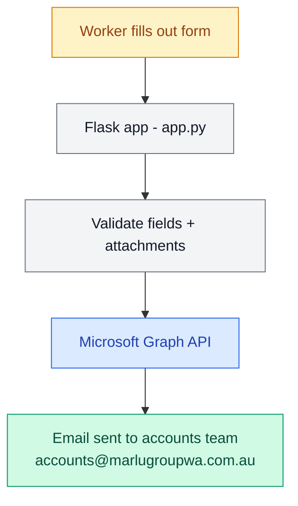

# Payroll Query System

A web form for workers to submit payroll queries directly to the accounts team via email.

## How it works



## What the form collects

| Field | Required |
|---|---|
| Full name | Yes |
| Phone number | Yes |
| Email address | Yes |
| Employer | Yes |
| Site | No |
| Pay period (start + end) | Yes |
| Query type | Yes |
| Description | No |
| Attachments (PDF, JPG, PNG, DOC, DOCX, XLS, XLSX) | No |

## Attachment Rules

- Max **3 files** per submission
- Max **20MB** total size
- Allowed types: PDF, JPG, PNG, DOC, DOCX, XLS, XLSX

## Technologies

- Python 3.11
- Flask
- Microsoft Graph API (send email via Office 365)
- Azure App Service (deployment)
- GitHub Actions (CI/CD)

```
## Project Structure
payroll-query-system/
├── app.py              Flask app + Graph API email logic
├── templates/
│   └── form.html       Payroll query web form
├── requirements.txt
├── startup.txt
└── .github/workflows/  Azure App Service deployment
```

## Environment Variables

| Variable | Description |
|---|---|
| GRAPH_TENANT_ID | Azure AD tenant ID |
| GRAPH_CLIENT_ID | Azure AD app client ID |
| GRAPH_CLIENT_SECRET | Azure AD app client secret |
| GRAPH_SENDER | Sender email address |
| GRAPH_TO | Recipient email (comma separated for multiple) |
